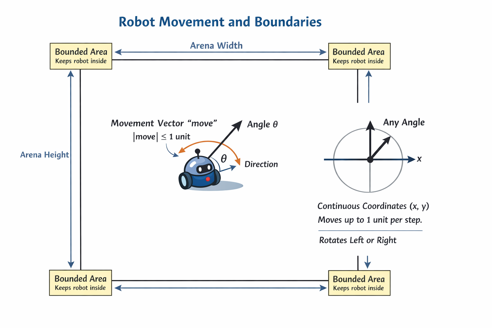
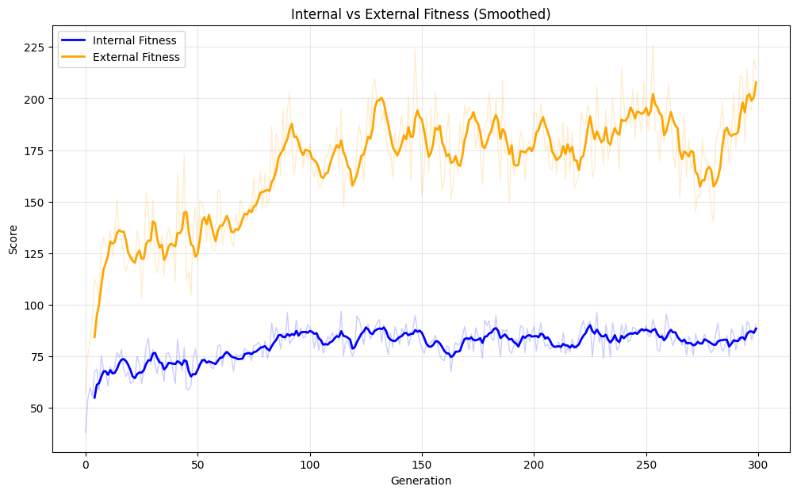

# Co-evolution_of_robots

[](https://github.com/Gabriele-tomai00/Co-evolution_of_robots/actions/workflows/build.yml)

Python project for the *Optimization for Artificial Intelligence* exam.

The goal is to study competitive co-evolution using NEAT (NeuroEvolution of Augmenting Topologies).  
Two simulated robots fight in a 2D arena; each robot is controlled by a small neural network evolved with NEAT.  
The evolutionary process tries to produce policies that move, rotate and shoot in order to survive and destroy the opponent.



---

## Project Structure

Repository root:

```text
project/
├── main.py
├── utils.py
├── arena.py
├── robot.py
├── sensors.py
├── controllers.py
├── neat_config.txt
├── requirements.txt
└── README.md
```

Short file summary:
- `main.py` – builds the NEAT configuration, creates the population, runs evolution and tests the best genome.
- `utils.py` – implements `simulate_battle`, `compute_fitness`, `eval_genomes`, and `test_best_genome_against_random_opponents`.
- `arena.py` – defines the 2D arena, step logic, boundary conditions and hit/damage computation.
- `robot.py` – represents a single robot (position, orientation, health, last action).
- `sensors.py` – computes a 7-dimensional sensor vector for each robot (opponent distance/angle, distance from walls, health).
- `controllers.py` – contains `RandomController`, `StaticShooter`, and `AggressiveChaser`.
---

## Main Operations

- **Sensor computation (`Sensors.get`)**
  - Given a robot and the arena, computes a fixed-size vector of 7 floats (`num_inputs = 7` in `neat_config.txt`):
    1. Normalized distance to the opponent (divided by arena diagonal).
    2. Normalized angle difference to the opponent (divided by PI to be in [-1, 1]).
    3. Normalized health (divided by max health).
    4. Normalized distance to the LEFT wall (divided by arena width).
    5. Normalized distance to the RIGHT wall (divided by arena width).
    6. Normalized distance to the BOTTOM wall (divided by arena height).
    7. Normalized distance to the TOP wall (divided by arena height).

- **Action decoding**
  - Reads the current sensor vector.
  - Feeds it to the NEAT-generated feed-forward network.
  - Interprets the three outputs as:
    - `move` ∈ ℝ: forward/backward motion (−1 = strong backward, +1 = strong forward).
    - `turn` ∈ ℝ: rotation (−1 = left, +1 = right).
    - `shoot` ∈ {False, True}: fire if output[2] > 0.5.

- **Battle simulation (`simulate_battle`)**
  - Instantiates two `Robot` objects with controllers corresponding to two neural networks.
  - Runs the battle for at most `MAX_STEPS` time steps (300 by default).
  - At each step:
    - Computes sensors for both robots.
    - Applies their actions (movement, rotation, shooting).
    - Updates the arena (damage, boundaries, death checks).
  - Stops when at least one robot dies or the step limit is reached.
  - Returns two fitness contributions, one for each controller.
  - The simulation is simultaneous (real-time): both robots perceive and act in the same time step, not turn-based.

- **Fitness computation (`compute_fitness`)**
  - **Non-zero-sum game**: A robot's gain is not necessarily the opponent's loss (e.g., survival bonus).
  - **Damage**: 
    - Inflicted: `+10` fitness per hit (added to shooter).
    - Received: `-10` health per hit (subtracted from victim's health, doesn't directly reduce fitness but leads to death).
  - **Survival**: `+0.1` fitness per step survived (up to `+30` total).
  - **Victory**: `+100` bonus for killing the opponent.
  - **Theoretical Max Fitness**: ~`230` 
    - `100` (Win) + `100` (Inflicting 100 damage to kill) + `30` (Surviving 300 steps).
    - Note: Actually slightly less than 230 because killing early reduces the survival bonus.

- **Genome evaluation (`eval_genomes`)**
  - Required by `neat-python`. For each generation:
    - Initializes all genomes with fitness 0 (resetting the score for the current tournament, though the learned network structure is preserved).
    - Builds a neural network for every genome.
    - Plays *round-robin* battles: every pair of genomes fights once.
    - Accumulates fitness from the battles into each genome.

- **Testing the best genome (`test_best_genome_against_random_opponents`)**
  - Validates the champion's robustness by fighting 100 matches against a mix of opponents: random (20%), static (40%), and aggressive chasers (40%).

---

## Program Flow

High-level execution when running `python main.py`:

1. **Initialization (in `main.py`)**
   - Sets a fixed random seed (`random.seed(0)`).
   - Loads NEAT configuration from `neat_config.txt`.
   - Creates a `neat.Population`

2. **Evolution loop**
   - Adds NEAT reporters
   - Runs evolution by calling:
     ```python
     winner = population.run(eval_genomes, GENERATIONS)
     ```
   - For each generation:
    - `population.run` invokes the user-defined `eval_genomes` function.
    - `eval_genomes` executes the competitive co-evolution logic (internal round-robin + external validation) as described in the **Main Operations** section.

3. **Selecting the best genome**
   - After all the generations, NEAT returns the best genome (`winner`).
   - Prints a summary table with:
     - `Genome ID`
     - `Fitness`
     - `Nodes`
     - `Enabled connections`
   - Optionally prints the raw genome structure if `--verbose` is used.
   - Serializes the best genome to `best_robot.pkl` using `pickle`.

4. **Testing phase**
   - Builds a feed-forward network from `winner`.
   - Runs `test_best_genome_against_random_opponents`:
     - Picks random genomes from `population.population`.
     - Simulates battles between `winner_net` and each random opponent.
     - Prints an ASCII table with match index, winner label and fitness scores.
   - Prints a final summary: total wins and losses of the best genome.

## Setup and Execution

### Requirements

- Python `>= 3.9`
- Recommended: virtual environment (venv, conda, etc.)

Python dependencies are listed in `requirements.txt`

### Running the evolutionary experiment

Basic run (minimal console output):

```bash
python main.py
```

Run with detailed NEAT logs:

```bash
python main.py --verbose
```
You can add the following parameter:
- `--generations N`: number of generations to run the experiment (default: 15).
- `--pop-size N`: maximum number of genomes in the population (default: 50).
- 


### Expected outputs

- Console logs of the NEAT evolutionary process for `GENERATIONS` generations.
- Final ASCII table summarizing the best genome (ID, fitness, nodes, connections).
- Saved best genome in:
  - `best_robot.pkl`
- Test phase summary:
  - ASCII table of battles between the best genome and random opponents.
  - Final line summarizing wins and losses of the best controller.

### Result
The following plot shows the fitness evolution of the best genome over 300 generations (Population: 50, Elitism: 2).



**Interpretation**:
- **Internal Fitness (Blue)**: Stabilizes between 75-100. This indicates a balanced "Red Queen" dynamic where the population evolves together, maintaining a competitive equilibrium (winning ~50% of the time against equally evolved peers).
- **External Fitness (Orange)**: Grows steadily from ~80 to >200. This confirms objective progress: the robots are becoming increasingly effective at defeating fixed opponents (Random, Static, Chaser), exploiting their weaknesses to maximize score and survival.
